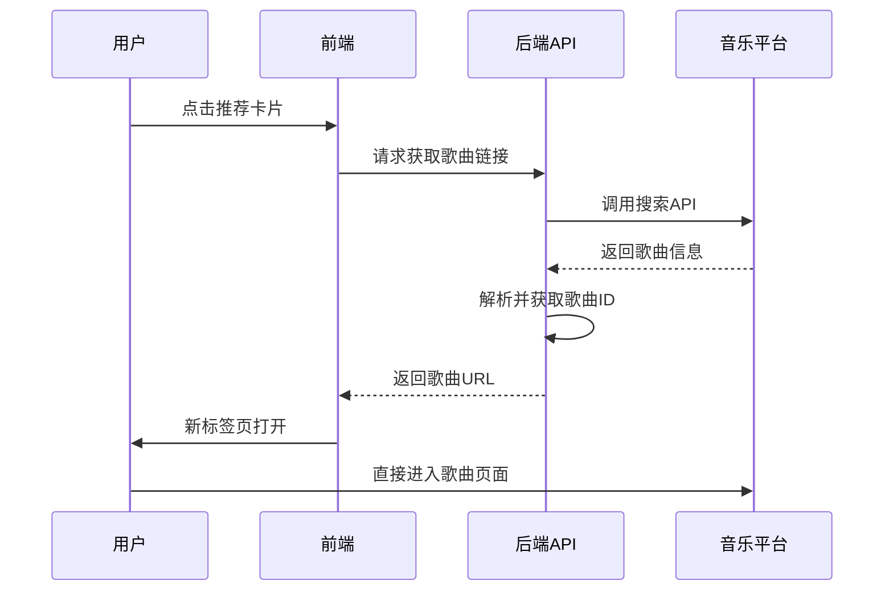
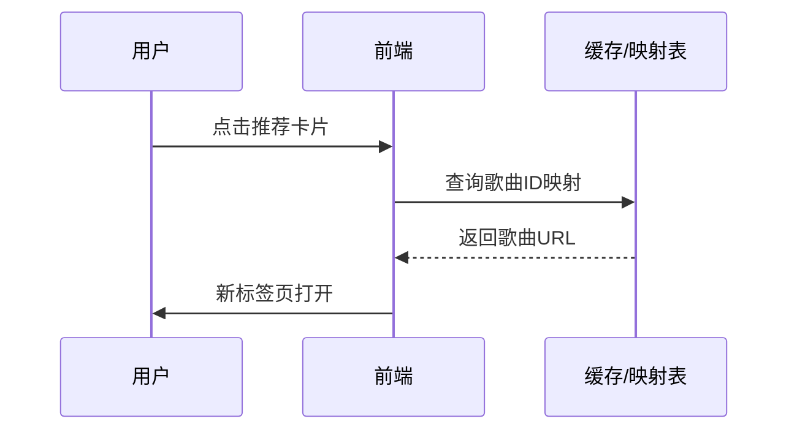
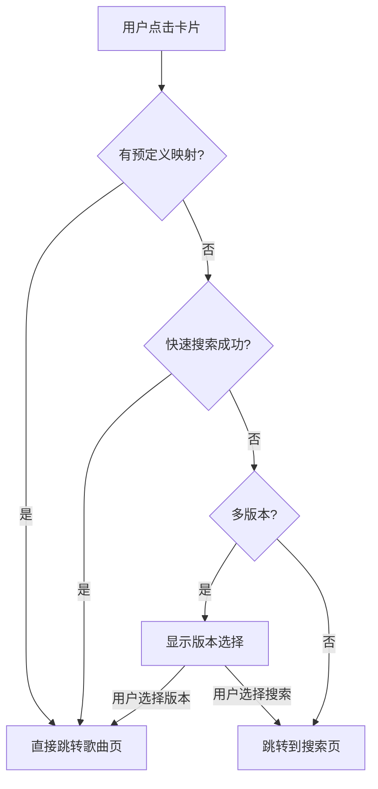

# 音乐平台深度跳转功能需求分析

## 一、现状分析

### 1.1 当前实现

#### 已实现功能
- **基础跳转**：点击推荐结果卡片，跳转到音乐平台搜索结果页
- **平台选择**：支持网易云音乐、QQ音乐切换
- **信息传递**：通过URL参数传递歌曲名和歌手名

#### 当前URL格式

**网易云音乐**：
```
https://music.163.com/#/search/m/{歌曲名} {歌手名}
```

**QQ音乐**：
```
https://y.qq.com/portal/search.html#page=1&searchid=1&remoteplace=txt.yqq.all&t=0&key={歌曲名} {歌手名}
```

### 1.2 功能局限性

| 问题 | 描述 | 影响 |
|------|------|------|
| 搜索结果模糊 | 搜索关键词可能匹配多首同名歌曲 | 用户需要手动筛选 |
| 无法直接播放 | 只能到达搜索页，不能直接播放指定歌曲 | 用户体验不够流畅 |
| 定位不准确 | 同名歌曲、不同版本混杂 | 可能找不到想要的版本 |
| 无错误反馈 | 搜索无结果时无提示 | 用户可能困惑 |

## 二、功能需求

### 2.1 核心功能需求

#### 需求1：精确歌曲定位
**优先级**：⭐⭐⭐⭐⭐

**描述**：
- 跳转后直接定位到指定歌曲
- 避免搜索结果页的二次筛选
- 支持多种匹配策略

**预期效果**：
```
用户点击"东风破-王菲"
    ↓
直接跳转到网易云音乐"东风破"歌曲页面
    ↓
用户可直接播放，无需手动搜索
```

#### 需求2：多版本选择
**优先级**：⭐⭐⭐⭐

**描述**：
- 当存在多个版本时，提供选择界面
- 显示版本信息（专辑、发行年份等）
- 支持手动跳转到搜索结果

**预期效果**：
```
用户点击"偏爱-张芸京"
    ↓
发现有两个版本（原版和翻唱）
    ↓
显示版本选择弹窗
    ↓
用户选择后跳转到对应版本
```

#### 需求3：智能匹配
**优先级**：⭐⭐⭐

**描述**：
- 根据歌手名精确匹配
- 优先显示官方版本
- 匹配失败时回退到搜索

**匹配优先级**：
1. 歌曲名 + 歌手名 精确匹配
2. 歌曲名 精确匹配 + 歌手名 模糊匹配
3. 歌曲名 模糊匹配
4. 回退到搜索结果页

### 2.2 非功能需求

#### 性能需求
| 指标 | 要求 |
|------|------|
| 跳转响应时间 | < 500ms |
| 平台API调用成功率 | > 99% |
| 匹配准确率 | > 90% |

#### 兼容性需求
- 支持Chrome、Firefox、Safari、Edge
- 支持iOS、Android移动端
- 支持主流音乐平台最新版本

#### 安全性需求
- 防止XSS攻击
- 防止URL注入
- 敏感信息脱敏

## 三、技术方案分析

### 3.1 平台API调研

#### 网易云音乐

**公开API情况**：
| API类型 | 可用性 | 说明 |
|---------|--------|------|
| 官方API | ❌ | 需要登录态，未公开 |
| 网页解析 | ⚠️ | 可能触发反爬虫 |
| 第三方库 | ⚠️ | 可能不稳定 |

**实现建议**：
```javascript
// 方案1：直接跳转歌曲页面URL
// 网易云歌曲URL格式
const neteaseSongUrl = (songId) => 
    `https://music.163.com/#/song?id=${songId}`;

// 方案2：通过搜索API获取歌曲ID
async function searchNetease(songName, singerName) {
    // 调用网易云搜索API
    const response = await fetch(
        `https://music.163.com/api/search/get?type=1&s=${encodeURIComponent(songName + ' ' + singerName)}`
    );
    // 解析结果，获取歌曲ID
}
```

**风险评估**：
- ⚠️ 网易云有反爬虫机制
- ⚠️ API可能随时变更
- ⚠️ 大量请求可能被封IP

#### QQ音乐

**公开API情况**：
| API类型 | 可用性 | 说明 |
|---------|--------|------|
| 官方API | ❌ | 未对外开放 |
| 网页解析 | ⚠️ | 结构复杂 |
| 第三方库 | ⚠️ | ncmApi等但维护不活跃 |

**实现建议**：
```javascript
// 方案1：直接跳转歌曲页面URL
// QQ音乐歌曲URL格式
const qqSongUrl = (songId) => 
    `https://y.qq.com/n/ryqq/player.html?id=${songId}`;

// 方案2：通过搜索API获取歌曲ID
async function searchQQ(songName, singerName) {
    // 调用QQ音乐搜索API
    const response = await fetch(
        `https://u.y.qq.com/cgi-bin/musicu.fcg?-=getuidatawebp&data=${encodeURIComponent(JSON.stringify({
            comm: { ct: 24, cv: 0 },
            req: {
                method: 'DoSearchForQQMusicDesktop',
                module: 'music.search.SearchCgiService',
                param: {
                    query: songName + ' ' + singerName,
                    num_per_page: 10,
                    page_num: 1,
                    search_type: 0
                }
            }
        }))}`
    );
}
```

**风险评估**：
- ⚠️ API请求结构复杂
- ⚠️ 响应格式可能变化
- ⚠️ 需要处理跨域问题

### 3.2 推荐实现方案

#### 方案A：服务端代理（推荐）⭐⭐⭐⭐⭐

**架构设计**：
```
用户点击卡片
    ↓
前端发送请求到后端API
    ↓
后端调用音乐平台API（或解析网页）
    ↓
后端返回歌曲ID或播放URL
    ↓
前端重定向到目标页面
```

**优点**：
- 避免前端跨域问题
- 可以添加缓存层
- 便于统一错误处理
- 可以集成反爬虫策略

**缺点**：
- 增加后端复杂度
- 需要维护平台映射
- 可能涉及版权问题

**实现代码**：
```python
# 后端API示例
@app.route('/api/get-song-url', methods=['POST'])
def get_song_url():
    data = request.json
    song_name = data.get('song_name')
    singer_name = data.get('singer_name')
    platform = data.get('platform', 'netease')
    
    # 调用平台搜索
    if platform == 'netease':
        song_id = search_netease(song_name, singer_name)
        url = f"https://music.163.com/#/song?id={song_id}"
    else:
        song_id = search_qq(song_name, singer_name)
        url = f"https://y.qq.com/n/ryqq/player.html?id={song_id}"
    
    return {'url': url, 'song_id': song_id}
```

#### 方案B：前端直接跳转（当前方案）

**架构设计**：
```
用户点击卡片
    ↓
前端生成搜索URL
    ↓
新标签页打开搜索结果
```

**优点**：
- 实现简单
- 无后端依赖
- 响应快速

**缺点**：
- 只能到搜索页
- 无法精确定位
- 用户体验一般

#### 方案C：混合方案（折中）⭐⭐⭐⭐

**架构设计**：
```
用户点击卡片
    ↓
检查是否有预定义的歌曲ID映射
        ↓是
    直接跳转歌曲页面
        ↓否
    尝试快速搜索API
        ↓成功
    跳转到歌曲页面
        ↓失败
    跳转到搜索结果页
```

**优点**：
- 性能与准确率平衡
- 可逐步完善映射表
- 用户体验较好

**缺点**：
- 需要维护映射表
- 映射表可能不完整
- 快速搜索可能失败

## 四、详细设计

### 4.1 功能流程设计

#### 深度跳转流程



#### 备选流程（映射表命中）



### 4.2 数据结构设计

#### 歌曲信息结构
```json
{
    "song_id": "123456",
    "song_name": "东风破",
    "singer_name": "周杰伦",
    "album_name": "叶惠美",
    "album_id": "789",
    "duration": 234,
    "platform": "netease",
    "play_url": "https://music.163.com/#/song?id=123456",
    "cover_url": "https://xxx.com/cover.jpg"
}
```

#### 映射表结构
```json
{
    "netease": {
        "东风破-周杰伦": "123456",
        "偏爱-张芸京": "234567",
        "青花瓷-周杰伦": "345678"
    },
    "qq": {
        "东风破-周杰伦": "001M3WDb3KWCxV",
        "偏爱-张芸京": "002M6QDb2iZKWV",
        "青花瓷-周杰伦": "003N2vDa2cB9c1"
    }
}
```

#### API响应结构
```json
{
    "success": true,
    "data": {
        "platform": "netease",
        "song_id": "123456",
        "song_name": "东风破",
        "singer_name": "周杰伦",
        "play_url": "https://music.163.com/#/song?id=123456",
        "alternative_urls": [
            {
                "platform": "qq",
                "url": "https://y.qq.com/n/ryqq/player.html?id=001M3WDb3KWCxV"
            }
        ]
    },
    "message": "success",
    "timestamp": 1704067200000
}
```

### 4.3 错误处理设计

#### 错误类型定义

| 错误码 | 错误类型 | 处理策略 |
|--------|----------|----------|
| 40001 | 参数错误 | 返回错误提示，请求前端验证 |
| 40002 | 平台不支持 | 显示平台选择界面 |
| 40003 | 歌曲不存在 | 跳转到搜索结果页 |
| 40004 | API调用失败 | 重试或跳转到搜索页 |
| 40005 | 解析失败 | 跳转到搜索结果页 |
| 40006 | 超时 | 重试或跳转到搜索页 |

#### 错误处理流程

```javascript
async function handleDeepLink(songInfo, platform) {
    try {
        const result = await fetchSongUrl(songInfo, platform);
        
        if (result.success) {
            // 成功：跳转到歌曲页面
            window.open(result.play_url, '_blank');
        } else {
            // 失败：根据错误码处理
            handleError(result.errorCode, songInfo, platform);
        }
    } catch (error) {
        // 网络错误等异常
        handleNetworkError(songInfo, platform);
    }
}

function handleError(errorCode, songInfo, platform) {
    switch (errorCode) {
        case '40003': // 歌曲不存在
            // 跳转到搜索结果页
            const searchUrl = generateSearchUrl(songInfo, platform);
            window.open(searchUrl, '_blank');
            showNotification('未找到该歌曲，已为您打开搜索结果', 'warning');
            break;
            
        case '40004': // API调用失败
        case '40005': // 解析失败
            // 尝试备用方案或搜索页
            fallbackToSearch(songInfo, platform);
            break;
            
        default:
            // 其他错误，显示通用提示
            showNotification('跳转失败，请稍后重试', 'error');
    }
}
```

### 4.4 用户体验设计

#### 交互流程



#### 反馈机制

| 场景 | 反馈方式 |
|------|----------|
| 跳转成功 | 显示"正在打开XX音乐..." |
| 跳转中 | 显示加载动画 |
| 跳转失败 | 显示错误提示 + 备用方案 |
| 多版本 | 显示选择弹窗 |

#### 加载状态设计

```css
.loading-overlay {
    position: fixed;
    top: 0;
    left: 0;
    width: 100%;
    height: 100%;
    background: rgba(0, 0, 0, 0.5);
    display: flex;
    justify-content: center;
    align-items: center;
    z-index: 10000;
}

.loading-content {
    background: white;
    padding: 20px 40px;
    border-radius: 12px;
    text-align: center;
}

.loading-spinner {
    width: 40px;
    height: 40px;
    border: 3px solid #f3f3f3;
    border-top: 3px solid #667eea;
    animation: spin 1s linear infinite;
}

.loading-text {
    margin-top: 12px;
    color: #666;
}
```

### 4.5 性能优化设计

#### 缓存策略

| 缓存类型 | TTL | 说明 |
|----------|-----|------|
| 歌曲ID映射 | 7天 | 热门歌曲ID长期缓存 |
| 搜索结果 | 1小时 | 临时缓存 |
| API响应 | 5分钟 | 避免频繁请求 |

#### 预加载策略

```javascript
// 预加载热门歌曲映射
async function preloadPopularSongs() {
    const popularSongs = getPopularSongs();
    for (const song of popularSongs) {
        const key = `${song.name}-${song.singer}`;
        if (!songMappingCache.has(key)) {
            // 预加载到缓存
            songMappingCache.set(key, await fetchSongId(song));
        }
    }
}

// 用户悬停时预加载
card.addEventListener('mouseenter', async () => {
    if (!isLoaded) {
        await preloadSongUrl(songInfo);
    }
});
```

## 五、实施计划

### 5.1 分阶段实施

#### 第一阶段：基础跳转（当前）
- ✅ 实现搜索结果页跳转
- ✅ 支持平台切换
- ❌ 未实现精确定位

#### 第二阶段：服务端代理
- [ ] 实现后端API
- [ ] 集成平台搜索API
- [ ] 添加缓存机制
- [ ] 实现错误处理

#### 第三阶段：智能匹配
- [ ] 构建歌曲ID映射表
- [ ] 实现多版本选择
- [ ] 添加匹配算法
- [ ] 优化用户体验

### 5.2 开发任务清单

#### 后端开发
| 任务 | 优先级 | 工时 |
|------|--------|------|
| 实现搜索API路由 | P0 | 2天 |
| 集成网易云API | P0 | 3天 |
| 集成QQ音乐API | P0 | 3天 |
| 添加缓存层 | P1 | 2天 |
| 错误处理 | P1 | 1天 |
| 测试用例 | P1 | 2天 |

#### 前端开发
| 任务 | 优先级 | 工时 |
|------|--------|------|
| 修改跳转逻辑 | P0 | 1天 |
| 添加加载状态 | P1 | 1天 |
| 添加错误提示 | P1 | 1天 |
| 多版本选择UI | P2 | 2天 |
| 性能优化 | P2 | 1天 |

### 5.3 测试计划

#### 测试用例

| 用例编号 | 测试场景 | 预期结果 |
|----------|----------|----------|
| TC001 | 精确匹配歌曲 | 跳转到歌曲页面 |
| TC002 | 模糊匹配歌曲 | 显示多个候选 |
| TC003 | 歌曲不存在 | 跳转到搜索页 |
| TC004 | 网络错误 | 显示错误提示 |
| TC005 | 平台不可用 | 切换到备用平台 |
| TC006 | 移动端跳转 | 正常跳转 |

## 六、风险评估

### 6.1 技术风险

| 风险 | 影响 | 可能性 | 应对措施 |
|------|------|--------|----------|
| 平台API变更 | 功能失效 | 中 | 定期监控，建立告警 |
| 反爬虫机制 | 无法获取数据 | 高 | 使用代理，控制频率 |
| 版权问题 | 法律风险 | 低 | 遵循平台规则 |

### 6.2 运营风险

| 风险 | 影响 | 可能性 | 应对措施 |
|------|------|--------|----------|
| 大量跳转请求 | 服务压力大 | 中 | 添加限流 |
| 缓存失效 | 体验下降 | 中 | 多级缓存策略 |
| 用户投诉 | 负面反馈 | 低 | 完善错误提示 |

## 七、总结

### 7.1 核心价值

实现深度跳转功能将：
- ✅ 提升用户体验：从搜索到直接播放
- ✅ 减少操作步骤：缩短用户路径
- ✅ 增强系统价值：提供一站式服务

### 7.2 实施建议

**推荐采用方案C（混合方案）**：
1. 先实现预定义映射表（快速、准确）
2. 再实现快速搜索API（兜底方案）
3. 最后完善多版本选择（提升体验）

### 7.3 后续优化

- 引入机器学习优化匹配算法
- 构建完整的歌曲数据库
- 实现更多音乐平台支持
- 添加用户反馈机制

---

## 附录

### A. 平台API文档

#### 网易云音乐API
- 搜索API：`https://music.163.com/api/search/get?type=1&s={keyword}`
- 歌曲详情：`https://music.163.com/api/song/detail?id={songId}&ids=[{songId}]`

#### QQ音乐API
- 搜索API：`https://u.y.qq.com/cgi-bin/musicu.fcg`
- 歌曲详情：`https://v.g.qq.com/v1/gateway`

### B. 常用工具

- JSON格式化：https://jsonformatter.org
- URL编码：https://www.urlencoder.org
- Base64编码：https://www.base64encode.org

### C. 参考资料

1. [网易云音乐WebAPI](https://github.com/Binaryify/NeteaseCloudMusicApi)
2. [QQ音乐WebAPI](https://github.com/jsososo/QQMusicApi)
3. [音乐API对比分析](https://www.jianshu.com/p/xxx)
